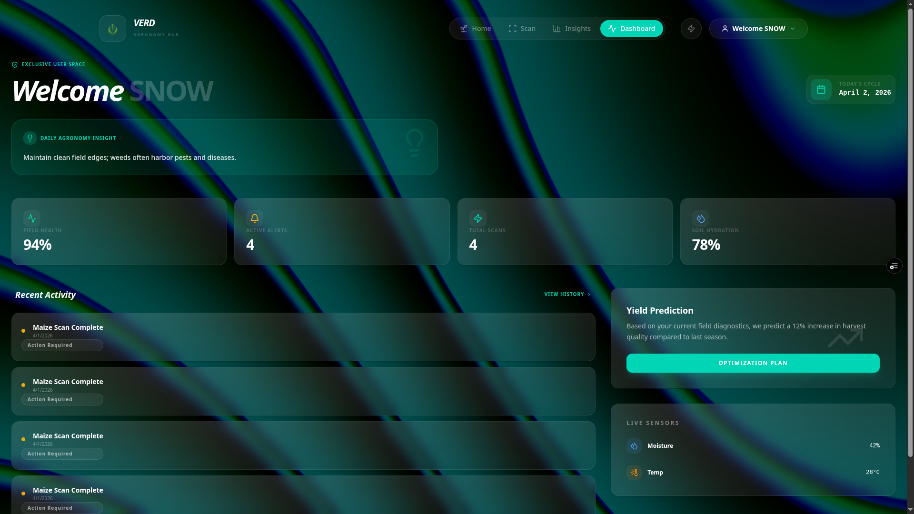
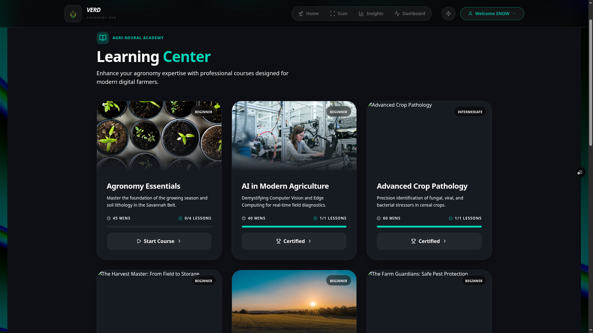

# 🌿 Verd - The Future of Green Intelligence

**Verd (from the French *Vert* / *Verdant*) - Transforming agricultural health with real-time diagnostics, premium aesthetics, and Ground-Truth insights.**

[Live Dashboard](https://verd-ui.vercel.app/) • [Technical Documentation](./TECHNICAL.md) • [The Verd Mission](#📖-introduction-why-verd)

**Platform Name:** Verd  
**Region Focus:** The Savannah Belt

---

## 📖 Introduction: Why Verd?

The name **Verd** is rooted in the French word for green (*vert*) and the concept of *verdancy*—the lush, healthy state of thriving vegetation. In the Savannah belt, where agriculture is the backbone of the community, maintaining this "verd" state is a constant battle against pathogens like Leaf Rust and Armyworm outbreaks.

- How do you identify a pathogen before it consumes the green heart of your harvest?
- What is the specific intervention for *this* field, under *this* humidity?
- Where is the record of my farm's health over the last three seasons?

**Verd solves this.** We’ve taken the cultural beauty of traditional agronomy and automated it with **React 19**, **Firebase**, and **High-Fidelity Shaders**. By removing the manual guesswork and replacing it with an AI-driven diagnostic engine, we eliminate the friction in community farming.

---

## ✨ Features that Make Verd Different

### 🤖 1. The Diagnostic Scanner
Verd isn't just a gallery; it's a field-grade diagnostic tool. Using your mobile camera, you can scan plants for instant health verification.

**What the AI can do NOW:**
- **Instant Pathogen Detection**: Detects Leaf Rust, Fungal Blight, and Nutrient Deficiencies with high confidence.
- **Smart Recommendations**: Get actionable advice based on identified issues.
- **Social Field Data**: Share localized scan results as high-fidelity result cards.

**Visual Identity & Themes:**
> [!TIP]
> **Switchable Aesthetics**: Verd features a dual-theme system accessible via the Navbar to suit different lighting conditions in the field:
> 1. **Blue like Theme**: A high-contrast "Liquid Metal" aesthetic with rainbow refractions.
> 2. **Green Family Theme**: A deep, animated "Neural Network" background for focus-heavy diagnostic sessions.

### 🎓 2. Ag-Learning Center
Knowledge is the best fertilizer. Our built-in Learning Center provides:
- **Localized Courses**: Deep dives into Savannah-belt specific crop management (e.g., Agronomy Essentials, AI in Modern Agriculture).
- **Certified Learning**: Earn certifications as you master advanced crop pathology.
- **Daily Field Tips**: Micro-learning moments for quick agricultural wins.

---

## 🖼️ See Verd in Action

| Liquid Metal Aesthetic | Learning Center | Dashboard Analytics |
| :---: | :---: | :---: |
|  |  |  |
| *Premium Shader Effects* | *Professional Agronomy Courses* | *Real-time Farm Health Metrics* |

---

## 🚀 Getting Started with Verd

Verd is a cloud-first platform. You don't need to install anything locally to start protecting your farm.

Visit **[verd.app](https://verd-ui.vercel.app/)** to begin your journey.

### 🗺️ The Onboarding Path

It only takes a few steps to start making your harvest smarter. Let’s walk through them together:

1.  **Create Account**: Securely create your profile so your scan history stays private and accessible everywhere.
2.  **Explore Dashboard**: Get familiar with your custom field insights and recent pathological trends.
3.  **Connect Sensors**: Link your field hardware or drone suite for real-time biometric data streaming.
4.  **Capture Sample**: Snap a clear photo of any crop issue. Our AI spots pathology markers instantly.

---

## 📜 Team & Contribution

This project was built with ❤️ by a dedicated team of ag-tech innovators:

- **Nasir Ibrahim Imam** (@IcedMist)
  - **Team Lead & Architect**: Created the full web architecture, design system, and core platform logic.
- **Benjamin Ofili** (@benjaminofili)
  - **Application Engineering**: Worked on the application development and core backend services.
- **Mudathir Mudathir** (@jibex-banks)
  - **AI Research**: Responsible for model training, evaluation, and pathological optimization.
- **Linus Blessing Asher**
  - **Data Engineering**: Focused on data extraction and cleaning to ensure high-quality training sets.
- **Onyinye**
  - **Mobile UI**: Spearheaded the user interface design for the mobile application.

---

## 📞 Get in Touch

Have questions or want to collaborate? Reach out to the project Lead Nasir at [talk2icedmist@gmail.com](mailto:talk2icedmist@gmail.com).

---
*Verd - Resilience, through Intelligence.*
