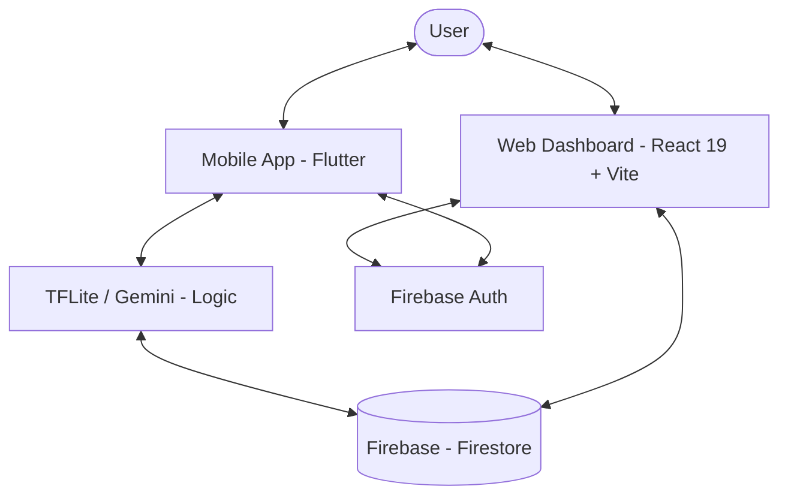

# 🏗️ Verd - Technical Documentation

This document provides a deep dive into the architecture, technology stack, and implementation details of **Verd** (Agri-Neural v2.0).

---

## ⚙️ Architecture Overview

Verd is built as a high-performance, visual-first platform where the **Source of Truth** is a centralized Firebase environment, spanning both Web and Mobile interfaces.

### System Architecture


Users can interact with the system through two main channels:
1.  **Web Dashboard**: A high-fidelity React interface for complex management, historical analysis, and ag-learning.
2.  **Mobile App**: A specialized field-grade interface (UI by Onyinye) focused on real-time diagnostic scanning and rapid data entry.

### The Flow of Data
- **Web**: React 19 + Vite -> Firebase SDK -> Firestore / Auth.
- **Diagnostics**: Mobile Camera -> TFLite Model (Logic by Mudathir) -> Result Analysis -> Firestore Sync.
- **Ground-Truth**: Firestore -> Real-time Aggregation -> Web Analytics (Yield Prediction).

---

## 🛠️ Technology Stack

| Layer | Technology | Why we chose it |
| :--- | :--- | :--- |
| **Framework** | [React 19](https://react.dev/) | Ultra-smooth performance and state-of-the-most-advanced-art UI capabilities. |
| **Language** | [TypeScript](https://www.typescriptlang.org/) | Type safety across the diagnostic pipeline and API responses. |
| **Database** | [Firebase Firestore](https://firebase.google.com/docs/firestore) | Real-time document-based storage for flexible agricultural diagnostic logs. |
| **Auth** | [Firebase Auth](https://firebase.google.com/docs/auth) | Seamless cross-platform authentication (Web/Mobile). |
| **Visuals** | [Three.js](https://threejs.org/) + [Paper Shaders](https://paper.design/) | Enables the "Blue like" and "Green Family" premium shader effects. |
| **Animations** | [Framer Motion](https://framer.com/motion/) | Industry-leading motion library for premium felt-interactions. |
| **Styling** | [Tailwind CSS 4](https://tailwindcss.com/) | Atomic CSS for performance and rapid design-to-code iterations. |

---

## 🔬 AI & Model Pipeline

### Model Training & Evaluation
The heart of Verd is its crop-pathology identification model.
- **Model Lead**: Mudathir Mudathir (@jibex-banks).
- **Execution**: Specialized CNN architectures trained and evaluated on localized datasets from the Savannah Belt.
- **Data Engineering**: Linus Blessing Asher handled the extraction and rigorous cleaning of the raw agricultural data.

### Field-Grade Implementation
Trust is essential in the field. The model is optimized for:
- **Accuracy**: High-confidence identification of Leaf Rust and Armyworm.
- **Speed**: Optimized for rapid feedback during diagnostic sessions.
- **Resilience**: Transitioning from Flutter/TFLite roots to support both mobile-native and web-resilient environments.

---

## 🚀 Local Development

To run Verd locally, follow these steps:

### 1. Clone & Install
```bash
git clone https://github.com/Jibex-Banks/_verd.git
cd verd
npm install
```

### 2. Environment Variables
Create a `.env.local` file. You will need your Firebase configuration:
- `VITE_FIREBASE_API_KEY`
- `VITE_FIREBASE_PROJECT_ID`
- (and other standard Firebase keys)

### 3. Start the Dev Server
```bash
npm run dev
```

---

## 🔒 Security & Privacy

### 1. Data Protection
- **Farm Privacy**: All agricultural data is scoped to the authenticated farm owner via Firebase Security Rules.
- **Encryption**: All diagnostic logs and user profiles are encrypted at rest within the Google Cloud infrastructure.

### 2. Platform Integrity
- **Real-time Monitoring**: Continuous monitoring of scan anomalies to prevent diagnostic errors.
- **Validated Interventions**: Diagnostic-to-recipe mappings are strictly derived from the official ag-protocol library.

---
*Maintained by the Verd Engineering Team.*
